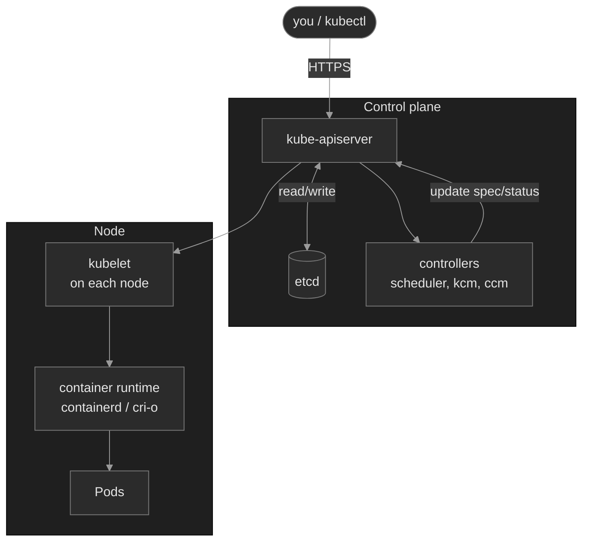
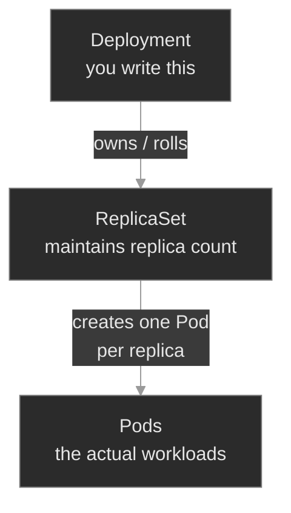

# M00 — Mental Model & kubectl Fluency

> The foundation. How a Kubernetes cluster is organized, how `kubectl` actually works, and the four-command diagnostic loop every later module assumes.

## What you'll learn

- Identify the components of a Kubernetes cluster and what each one does
- Trace any `kubectl` command back to the HTTP request it produces
- Read any Kubernetes object using the universal `spec` / `status` shape
- Apply the canonical diagnostic loop — `get` → `describe` → `events` → `logs` — in order
- Pivot to cluster-wide situational awareness when you don't know where a problem lives
- Avoid the most common context/namespace mistakes that lead to wasted time or, worse, production blast radius

## Why it matters

The most common reason SREs flounder with Kubernetes is reaching for commands before having a mental model. Memorizing `kubectl get pods` without knowing why `-A` matters. Running `describe` without knowing where Events come from. Editing a Deployment and being surprised when a controller they didn't know existed creates a new ReplicaSet.

You operate dozens of clusters at Polyphone — across regions and environment tiers — built and changed by people who aren't always still on the team. The skill that compounds is not memorization. It's the instinct to orient yourself fast, ask the cluster what it knows, and read what it tells you. This module is short on commands and long on concepts; every later module assumes you finished it.

## Scope

**Covers:** cluster anatomy (control plane vs nodes, the API server's role), the `spec` / `status` resource model, the canonical diagnostic loop (`get → describe → events → logs`), `kubectl` fluency for the everyday verbs and flags, reading the API with jsonpath / custom-columns / jq, and the most common pitfalls around context and namespace state.

**Doesn't cover:** writing Deployments or other workload objects (M01), Service/networking depth (M04), configuration via ConfigMaps/Secrets (M03), security/RBAC (M10), CRDs and operators (M08). The breakfix scenarios touch a few of these primitives lightly so you can diagnose; the full mechanics come in later modules.

**Assumes:** a container is a process-level isolation primitive; you're comfortable with basic Unix shell (`cd`, `ls`, `grep`, pipes, backgrounding with `&`); you've at least heard of Kubernetes as a container orchestrator. If you've never run `docker run`, start with a containers primer first.

## Vocabulary

| Term | Definition |
|------|------------|
| **Control plane** | The components that decide what should run: API server, etcd, scheduler, controller manager. |
| **Node** | A machine (VM or bare metal) that runs Pods. Hosts a kubelet and a container runtime. |
| **Pod** | The smallest deployable unit. Wraps one or more **containers** that share a network namespace (one IP), storage volumes, and lifecycle. |
| **Container** | The actual running process, packaged as an OCI image. A Pod runs one or more containers; in most cases it's exactly one. |
| **API server** (`kube-apiserver`) | The single entry point to the cluster. Reads and writes etcd. Authenticates and authorizes every request. |
| **etcd** | The cluster's database. A distributed key-value store holding desired and observed state of every object. |
| **kubelet** | The agent on each node that talks to the API server and instructs the container runtime. |
| **Controller** | A program that watches the API for objects of a certain kind and acts to make their `status` match their `spec`. |
| **Object** (a.k.a. **resource**) | An addressable thing in the cluster: Pod, Deployment, Service, Node, etc. |
| **Kind** | The type of an object — `Pod`, `Deployment`, `Service`. |
| **Label / Selector** | A `key=value` tag attached to any object (label), and the filter syntax that finds objects by those tags (selector). Services, Deployments, and NetworkPolicies all use selectors to find the Pods they care about. |
| **Namespace** | A logical grouping inside a cluster. Most objects are namespaced; a few (Nodes, PersistentVolumes, ClusterRoles) are cluster-scoped. |
| **Spec** | The desired state declared on an object — what you want. |
| **Status** | The observed state reported by controllers — what is. |
| **Reconciliation** | The continuous loop in which controllers compare `spec` to `status` and try to converge them. |
| **Deployment** | Workload controller for stateless, fungible Pods. Owns a ReplicaSet; handles rolling updates when the Pod template changes. |
| **ReplicaSet** | The controller a Deployment creates to maintain a target replica count. You almost never write one directly — the Deployment owns and rolls it for you. |
| **StatefulSet** | Workload controller for Pods that need stable identity (`name-0`, `name-1`), per-Pod persistent storage, and ordered start/stop. |
| **DaemonSet** | Workload controller that runs exactly one Pod per (matching) node. Used for node-local agents — log shippers, network plugins, edge proxies. |
| **Service** | A stable virtual IP + DNS name that load-balances across a set of Pods selected by labels. Types: `ClusterIP` (internal), `NodePort` (per-node port), `LoadBalancer` (cloud LB). |
| **PersistentVolumeClaim (PVC)** | A Pod's request for persistent storage of a given size and class. Bound to a PersistentVolume (PV); PVCs are namespaced, PVs are cluster-scoped. |
| **ResourceQuota** | A per-namespace cap on what can exist there — Pod count, total CPU/memory requests, PVC count, etc. The API server rejects creates that would exceed the cap. |
| **Context** | A kubeconfig entry pointing at a cluster + user + default namespace. |
| **Event** | A timestamped note attached to an object, describing something that happened to it. |

## Mental model

A Kubernetes cluster has two halves. The **control plane** decides what should run; the **nodes** actually run it. The API server is the only thing that talks to etcd; everything else — including `kubectl` — goes through the API server<sup><a href="https://kubernetes.io/docs/concepts/overview/components/">[1]</a></sup>.



This picture carries one load-bearing insight: **`kubectl` is a thin HTTPS client over the API server.** Every `kubectl get`, `apply`, `edit` is an HTTP request. Whatever a controller does, you could do too — controllers are programs that watch the API and react. There is no magic.

## Concept walkthrough

The walkthrough breaks into four moves:

1. **How the cluster decides things** — what objects exist, and how controllers converge them.
2. **How kubectl talks to the cluster** — the thin REST client and the day-to-day toolkit.
3. **How to ask questions when something's wrong** — the diagnostic loop and cluster-wide awareness.
4. **Knowing where you're pointed** — context and namespace orientation.

### How the cluster decides things

#### The resource model — everything is an object

Every thing in Kubernetes is an object addressed by three coordinates: `kind`, `namespace`, `name`. Most are namespaced; a few are cluster-scoped (Nodes, PersistentVolumes, ClusterRoles).

Every object has the same skeleton<sup><a href="https://kubernetes.io/docs/concepts/overview/working-with-objects/">[2]</a></sup>:

```yaml
apiVersion: apps/v1
kind: Deployment
metadata:
  name: portal-ui
  namespace: admin-portal
  labels:
    app: portal-ui
spec:
  # what you want
status:
  # what the controllers observe
```

`spec` is yours — you write it. `status` belongs to the controllers; they update it as the cluster converges. When something is wrong, the gap between `spec` and `status` is where the story lives. Every diagnostic command exists to expose part of that gap.

<details>
<summary>📖 Going deeper: namespace boundaries — what crosses, what doesn't<sup><a href="https://kubernetes.io/docs/concepts/overview/working-with-objects/namespaces/">[7]</a></sup></summary>

Namespaces are organizational scoping + RBAC scope + a DNS prefix. They are **not** a security boundary.

What crosses namespaces:
- **Services** — resolvable cluster-wide via `<svc>.<ns>.svc.cluster.local`. A pod in `admin-portal` can call `portal-ui.admin-portal` directly.
- **PersistentVolumes** — cluster-scoped; can be bound by a PVC in any namespace (subject to StorageClass policy).
- **Nodes, ClusterRoles, IngressClasses, StorageClasses** — cluster-scoped, visible from everywhere.

What doesn't:
- **Secrets, ConfigMaps, ServiceAccounts** — namespaced; a Pod can only mount one from its own namespace.
- **NetworkPolicies** — selectors are namespace-scoped unless you explicitly use a `namespaceSelector` (M14).
- **RBAC** — `Role` + `RoleBinding` is namespaced; `ClusterRole` + `ClusterRoleBinding` is cluster-wide. Mixing them is the most common RBAC bug.

This matters operationally: if your workload in namespace `A` "can't see" something in namespace `B`, the answer is almost always one of (a) it's namespaced and you're looking from the wrong place, (b) the FQDN you need is `<thing>.B.svc.cluster.local`, or (c) a NetworkPolicy is blocking the cross-namespace call.

</details>

<details>
<summary>📖 Going deeper: owner references and cascading deletion<sup><a href="https://kubernetes.io/docs/concepts/architecture/garbage-collection/">[8]</a></sup></summary>

Objects can own other objects. A Deployment owns ReplicaSets; ReplicaSets own Pods. When you delete the owner, what happens to the dependents depends on the deletion propagation policy:

- **Background** (default): API server returns immediately; the garbage collector deletes dependents asynchronously.
- **Foreground**: API server returns only after dependents are fully gone. The owner gets a `metadata.deletionTimestamp` and a `foregroundDeletion` finalizer; the GC removes the finalizer once dependents are gone.
- **Orphan**: dependents stay; they just lose their `ownerReference`.

Two surprises this causes:

1. **`kubectl delete pod <pod>` on a Deployment-owned pod doesn't kill the workload.** The ReplicaSet immediately recreates the pod. To actually remove the workload, delete the Deployment (which cascades down).

2. **`kubectl delete` seems to hang.** Look at `kubectl get <kind> <name> -o yaml` and check `metadata.finalizers`. Some controller is supposed to clean up before deletion can complete and hasn't. Common culprits: CSI driver finalizers on PVCs, cert-manager finalizers on Certificates, custom-resource finalizers from operators that have been uninstalled.

</details>

#### The reconciliation loop

You don't create Pods directly (you can, but you don't). You create higher-level objects — Deployments, StatefulSets, DaemonSets — and controllers create Pods for you. The Deployment controller watches Deployments. The ReplicaSet controller watches ReplicaSets. The scheduler watches Pods with no node assignment.

For Deployments specifically, the chain has three levels:



This **owner chain** matters for diagnosis. When a controller fails to create something, the failure event attaches to the *creator*, not to the thing that wasn't created. That's why `kubectl describe pod` shows nothing for a Pod that never got created — you must `kubectl describe rs` or `kubectl get events -n <ns>` instead. You'll exercise this exact instinct in `breakfix-03`. The same shape applies to other owner chains you'll meet later (`CronJob → Job → Pod`, `PVC → PV → StorageClass`).

A Deployment is a contract: "always have N replicas of this Pod template running." A controller reads the spec ("3 replicas"), reads the status ("2 ready"), and acts ("create one more"). Delete a Pod and the ReplicaSet controller creates a new one within seconds. Change the template and the Deployment controller runs a rolling replacement.

This is the difference between Kubernetes and a configuration management tool. You describe outcomes, not steps. You don't tell Kubernetes "start a container, wait for it, check it." You tell it "there should be a thing that looks like this." Controllers handle the rest, forever, on every cluster<sup><a href="https://kubernetes.io/docs/concepts/architecture/controller/">[4]</a></sup>.

### How kubectl talks to the cluster

#### kubectl is a thin client

When you run `kubectl get pods -n admin-portal`, kubectl:

1. Reads your kubeconfig (typically `~/.kube/config`)
2. Resolves the current context: which cluster, which user, which default namespace
3. Builds an HTTPS request: `GET /api/v1/namespaces/admin-portal/pods`
4. Authenticates with the credential the context specifies (cert, token, OIDC, exec plugin)
5. Receives JSON, formats it as a table, prints it<sup><a href="https://kubernetes.io/docs/reference/kubectl/">[3]</a></sup>

That's it. `kubectl describe` does the same and also fetches related objects (events sharing the same UID, owner-reference chains) and pretty-prints them. `kubectl apply` is a `PATCH` with server-side apply semantics. `kubectl logs` proxies through the API server to `/log` on the kubelet.

The implication for diagnosis: when `kubectl` returns weird output, the first question is "what API call did it make, and what did the server say?" Add `-v=6` to any command and you'll see the raw URLs and status codes:

```bash
kubectl get pods -n admin-portal -v=6
```

<details>
<summary>📖 Going deeper: how <code>kubectl</code> authenticates<sup><a href="https://kubernetes.io/docs/concepts/security/controlling-access/">[5]</a></sup></summary>

The `users` block in your kubeconfig defines the credential. Four common shapes:

- **Client certificate** (`client-certificate` / `client-key`) — most common in local clusters (kubeadm bootstraps an admin cert for you).
- **Bearer token** (`token`) — service accounts use these; you'll see them when running pods that talk to the API.
- **OIDC** (`auth-provider: oidc` or, modern, `exec` plugin invoking an OIDC helper) — most cloud K8s offerings (EKS, GKE, AKS) authenticate human users this way against a corporate IdP.
- **Exec plugin** (`exec:`) — kubeconfig calls an external binary (`aws eks get-token`, `gke-gcloud-auth-plugin`, etc.) which prints a fresh token to stdout. Lets cloud providers do short-lived credentials without you noticing.

When a cluster says "Unauthorized" and the cert hasn't expired, the most common culprit is an exec plugin that can't find its dependency on `$PATH`.

</details>

#### Common kubectl idioms — what you'll type day-to-day

Eight verbs and a handful of flags carry you through 90% of routine work:

| Verb | Use |
|---|---|
| `get` | List objects — "what's there?" |
| `describe` | Pretty-print one object + its recent events |
| `logs` | Stream a container's stdout/stderr |
| `exec` | Run a command inside a running container |
| `apply` | Create or update from a manifest — the GitOps verb |
| `edit` | Open the live object in `$EDITOR`, save to apply — triage only |
| `delete` | Remove an object (cascades to dependents by default) |
| `port-forward` | Tunnel a local port to a Pod or Service |

Flags you'll combine endlessly: `-n <ns>`, `-A`, `-l key=value`, `-o wide` / `-o yaml` / `-o json`, `--watch`, `-f` (follow logs), `-c <container>`, `--previous`.

**`edit` vs `apply`:** `edit` is triage (opens live object, applies on save, diverges from GitOps); `apply` is declarative (three-way merge against your manifest, same operation Flux/Argo run). Change the manifest in git → `apply` for anything persistent. Read-only commands are safe anywhere; state-changing commands need a context check first — `breakfix-01` shows what happens when you skip it.

<details>
<summary>📖 Going deeper: server-side apply — why <code>kubectl apply</code> surprises you<sup><a href="https://kubernetes.io/docs/reference/using-api/server-side-apply/">[6]</a></sup></summary>

`kubectl apply` doesn't simply overwrite the object. It does a three-way merge: the live state on the server, the previous applied configuration (stored in an annotation in older versions; tracked by `managedFields` since 1.22), and your new configuration<sup><a href="https://kubernetes.io/docs/reference/using-api/server-side-apply/">[6]</a></sup>. Fields you removed from your YAML get removed from the live object. Fields you didn't touch are left alone.

Two surprises you'll hit eventually:

- **Conflict errors** when another field manager (a different tool, a controller, or a previous `kubectl edit`) owns a field you're trying to set. The fix is either `--force-conflicts` (you take ownership) or coordinating with whoever owns the field.
- **Disappearing fields** when you apply a YAML that omits a field someone else (or a controller) added. Server-side apply remembers who set what; if you used to set it, removing it from your YAML deletes it from the object.

This is why GitOps tools that own a manifest end-to-end (Flux, Argo CD) avoid most of these — they're the single field manager. You'll meet that pattern in M18.

</details>

#### Reading the API: jsonpath, custom-columns, jq

Every Kubernetes object is JSON under the hood. Three tools pull specific fields out:

| You want… | Reach for | Example |
|---|---|---|
| One field | `-o jsonpath` | `kubectl get deploy foo -o jsonpath='{.spec.replicas}'` |
| A quick table | `-o custom-columns` | `kubectl get pods -A -o custom-columns=NS:.metadata.namespace,NAME:.metadata.name,NODE:.spec.nodeName` |
| Filter / transform | `\| jq` | `kubectl get pods -A -o json \| jq '.items[] \| select(.spec.nodeName == "n1")'` |

jsonpath ships with `kubectl`; jq is the de facto JSON query tool and handles `select`, `map`, `group_by`, and string composition that jsonpath can't. The `{range .items[*]}…{end}` template is the most useful pattern in jsonpath.

<details>
<summary>📖 Going deeper: <code>-l</code> vs <code>--field-selector</code> vs <code>jq</code> — three ways to filter</summary>

Three filtering mechanisms with very different cost:

- **`-l key=value`** (label selector) — server-side, labels indexed, cheapest. Use whenever you can.
- **`--field-selector status.phase=Pending`** — server-side but limited. Selectable fields are a small set per resource (commonly `metadata.name`, `metadata.namespace`, `spec.nodeName`, `status.phase`).
- **`jq '.items[] | select(...)'`** — client-side. You fetched ALL objects; jq filtered after. Slow on large clusters, but works for any condition.

Prefer labels → field selectors → jq, in that order. If you're jq-filtering by something that could be a label, add the label.

</details>

### How to ask questions when something's wrong

#### The canonical diagnostic loop

When something is wrong, you reach for the same four commands in the same order:

```text
1. kubectl get <kind> -n <ns>           what's there? current phase?
   |
   v
2. kubectl describe <kind> <name> -n <ns>   what happened to it?
   |                                        events filtered to this object's UID
   v
3. kubectl get events -n <ns>           what's happening in the neighborhood?
   --sort-by='.lastTimestamp'           (events on other objects you didn't think to describe)
   |
   v
4. kubectl logs <pod> [-c <ctr>] -n <ns>    what does the app itself say?
   [--previous if crashed]
```

This loop is the foundation. If you do nothing else from this module, internalize it. Almost every problem in later modules — broken Services, scheduling failures, OOMKills, image pull errors, PVC binding issues — surrenders to this loop, in order.

`get` tells you *what's there.* `describe` tells you *what happened to it.* `events` tells you *what's happening in the neighborhood.* `logs` tells you *what the app thinks.*

The most common skipped step is `events`. Many problems have an answer that's plain text in `kubectl get events --sort-by='.lastTimestamp'` and learners never run it.

#### Cluster-wide situational awareness

When you don't know which namespace something is in, pivot to cluster-wide before zooming in:

```bash
kubectl get pods -A                                                                    # everything, everywhere
kubectl get pods -A --field-selector=status.phase!=Running,status.phase!=Succeeded     # only the unhappy ones (excludes Completed)
kubectl get events -A --sort-by='.lastTimestamp' | tail -50                            # recent activity, cluster-wide
```

> Why `!=Succeeded`? A Pod's `status.phase` has five values: `Pending`, `Running`, `Succeeded`, `Failed`, `Unknown`. `Succeeded` is a *good* terminal state (typical of Job/CronJob pods that finished cleanly). Filtering only `!=Running` would lump Completed pods in with the broken ones. In labs you'll also see this with `local-path-provisioner` helper pods that exit `Succeeded` after binding a PVC.

The `-A` flag (alias of `--all-namespaces`) is your friend whenever you're triaging an unfamiliar situation. The first command for "something is broken somewhere on the cluster" is always `kubectl get pods -A`.

### Knowing where you're pointed

#### Contexts and namespaces

```bash
kubectl config get-contexts                                       # list known contexts
kubectl config current-context                                    # which cluster am I on?
kubectl config set-context --current --namespace=admin-portal     # set default ns
```

The most embarrassing class of incident in a multi-cluster shop is running a state-changing command against the wrong cluster. Always run `current-context` before any apply/patch/delete on production. Better: customize your shell prompt to display the current context, or use a tool like `kubectx` / `kubens` / `kubeswitch` so the active cluster is always visible.

## Hands-on

The M00 module has four scenarios. Each is a separate Killercoda environment provisioned with the full Polyphone fleet. Work them in order — each one stresses a different instinct from this lesson.

- **`baseline/`** — A guided tour of a healthy cluster. Cluster anatomy, the Polyphone fleet, common `kubectl` idioms, JSON unpacking with jsonpath/jq, and the diagnostic loop applied to a healthy workload. No fix required; the point is to internalize the patterns.
- **`breakfix-01-context-blindness/`** — `kubectl get pods` returns "No resources found." It looks like the cluster is empty. Tests the suspect-your-view-first instinct: read the error message, run `-A`, check `kubectl config view --minify` before assuming the cluster is broken. The simplest instinct, taught first.
- **`breakfix-02-namespace-blindness/`** — An alert fires with no namespace hint. Tests the `kubectl get pods -A` instinct: when you don't know where a problem lives, scan cluster-wide *before* zooming in.
- **`breakfix-03-event-only-failure/`** — A Deployment is short a replica, but every existing Pod looks fine and `describe pod` shows nothing. Tests the climb-the-owner-chain instinct: when the Pod-level loop comes up empty, the event lives on the controller that tried (and failed) to create the Pod.

After each scenario, check yourself against `ANSWER-KEY.md` — it walks through the canonical diagnostic path, names the instinct under test, and contrasts the production fix (GitOps source of truth) with the immediate triage fix.

## Common failure modes

| Symptom | Likely cause | Where to look |
|---------|--------------|---------------|
| `kubectl get pods` returns nothing | Wrong default namespace or wrong context | `kubectl config get-contexts`, then retry with `-A` |
| `describe` shows nothing useful | You're describing the wrong kind — the event is on the owning controller (ReplicaSet, Job) | `kubectl get events -n <ns>`, `kubectl describe rs/deploy` |
| `kubectl logs` returns nothing or "previous terminated" | Container hasn't started, or just got replaced | `--previous`; `describe` for `Last State` |
| `kubectl apply` succeeds but nothing changes | Applied to the wrong context, or another field manager owns the field | `current-context`; `kubectl get -o yaml` and inspect `managedFields` |
| Commands work for you, not a teammate | Different kubeconfig contexts pointing at different clusters | Compare `current-context` between the two terminals |

## Recap

- The control plane decides what should run; nodes run it. The API server is the only thing that talks to etcd; everything else, including `kubectl`, goes through the API server.
- `kubectl` is a thin HTTPS client. Every command is an API call. `-v=6` shows the exact request.
- Every object has the same `spec` (what you want) / `status` (what is) shape. When something's wrong, the gap between the two is where the answer lives.
- Controllers reconcile spec to status continuously. You describe outcomes; they handle the steps.
- The diagnostic loop is `get → describe → events → logs`, in order. When you don't know *where* to look, scan cluster-wide with `-A` first. `events` is the most-skipped step and often the fastest path to the answer.

## Production thinking

- A 5,000-pod cluster makes `kubectl get pods -A` return 5,000 lines. How do you triage at that scale? (`--field-selector`, `jq`, dashboards.)
- The diagnostic loop assumes the API server is reachable. If you're paged and the API server itself is down, what do you check first?
- You've spent 20 minutes in `prod-us-east-1`. You now need to change something in `lab-us-east-1`. What's the workflow that makes a wrong-cluster mistake impossible? (Prompt customization, separate terminals, `kubeswitch`, named windows.)

## References

1. Kubernetes Components — https://kubernetes.io/docs/concepts/overview/components/
2. Kubernetes Objects — https://kubernetes.io/docs/concepts/overview/working-with-objects/
3. kubectl Reference — https://kubernetes.io/docs/reference/kubectl/
4. Controllers — https://kubernetes.io/docs/concepts/architecture/controller/
5. Controlling Access to the Kubernetes API — https://kubernetes.io/docs/concepts/security/controlling-access/
6. Server-Side Apply — https://kubernetes.io/docs/reference/using-api/server-side-apply/
7. Namespaces — https://kubernetes.io/docs/concepts/overview/working-with-objects/namespaces/
8. Garbage Collection — https://kubernetes.io/docs/concepts/architecture/garbage-collection/
